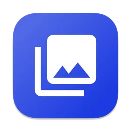
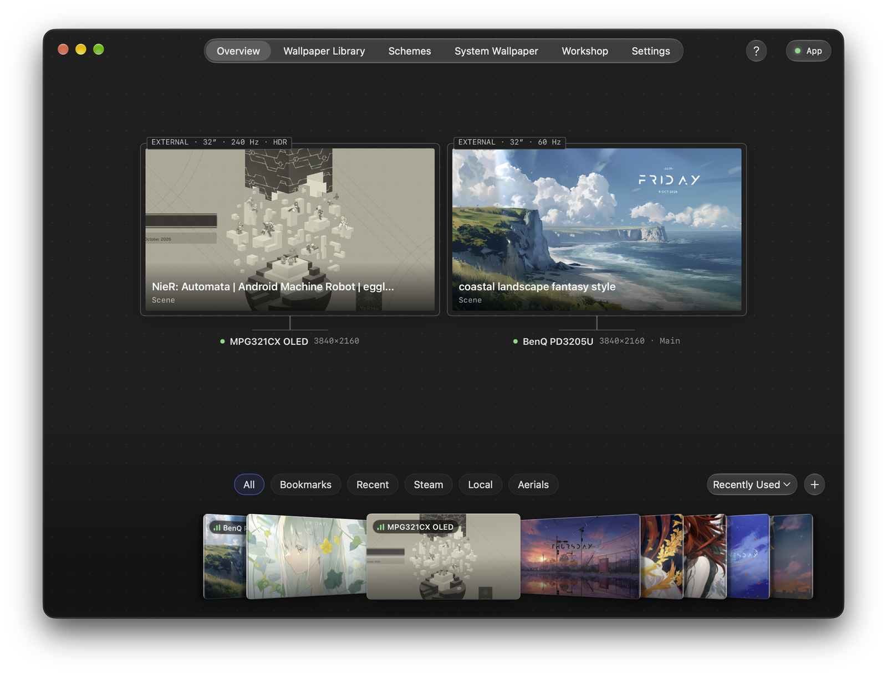
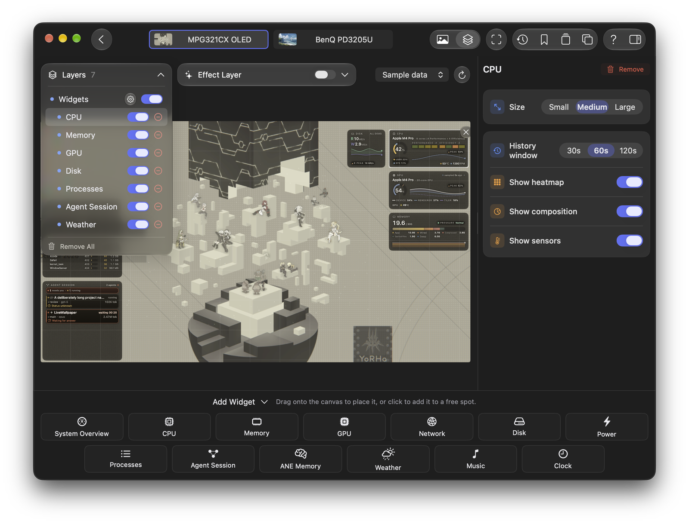
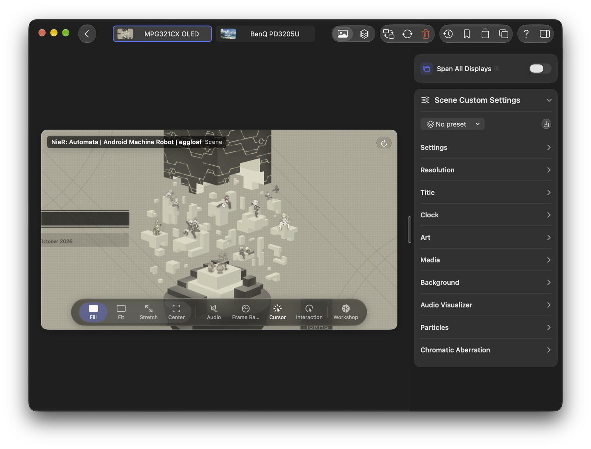
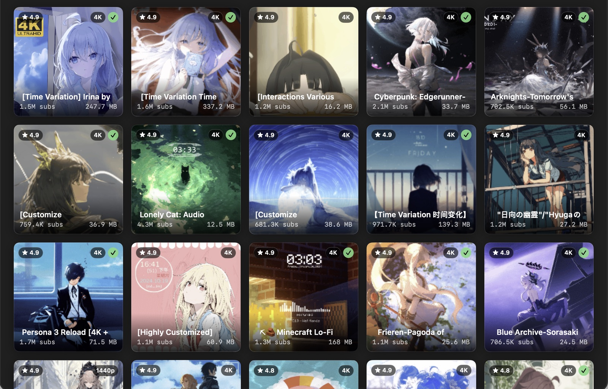

# Loomscreen

<div align="center">



### A living desktop, arranged your way.

Native macOS live wallpapers, a visual workspace for every display, and widgets, music and weather in one overlay canvas. Pro adds Wallpaper Engine scenes rendered with Metal and Steam Workshop.


[🏠 Website](https://paradox07127.github.io/Loomscreen-WebUI/) ·
[⬇ Download](https://github.com/Paradox07127/macos-wallpaperengine/releases/latest) ·
[🚀 Quick Start](docs/en/quick-start.md) ·
[✨ Features](docs/en/features.md) ·
[⚖ Lite vs Pro](docs/en/lite-vs-pro.md) ·
[🛠 Build](docs/en/building.md) ·
[🌐 中文](README.zh-Hans.md)



</div>

> Lite and Pro are both free and open source under MIT. The renderer is an independent implementation, not affiliated with Wallpaper Engine; compatibility varies by project. Workshop downloads use your own Steam account and license.

## Your desktop, in one workspace

1. **See every display** in Overview, arranged like your Mac's desktop.
2. **Choose a wallpaper** from the shelf or the unified Wallpaper Library, then drag it onto a display or apply it by name.
3. **Make it yours** in the display editor: tune playback, arrange widgets, clock and music together, and save a display scheme.

The menu bar keeps everyday controls close. Closing the management window keeps wallpapers running. [Explore the workspace](docs/en/workspace.md).

| **One canvas for your layers.** Arrange widgets, clock and music together. | **Wallpaper Engine scenes on Mac.** Pro renders compatible scenes natively with Metal. |
|:---:|:---:|
|  |  |

## Wallpaper types

| Type | Edition | What you get |
|---|---|---|
| **Wallpaper Engine scenes** | Pro | Native Metal renderer for `scene.pkg` projects — particles, shader effects, puppet-warp animation, audio-reactive layers, cursor effects. Import local project folders or download via Steam Workshop, including community presets. Compatibility varies by project. |
| **Video** | Lite + Pro | `mp4` / `m4v` / `mov` / `avi`, smooth looping, HDR-aware color pipeline, per-display or spanned across all displays. |
| **Web pages** | Lite + Pro | Sandboxed `WKWebView` with JavaScript toggle, tracker blocking, custom CSS, and auto-refresh. |
| **Apple Aerials** | Lite + Pro | Browse and apply the Apple TV aerial videos already on your Mac. |

<p align="center">
  <br />
  <sub>Pro: browse Steam Workshop and download with your own Steam account.</sub>
</p>

## More than a player

- **Per-display control** — every monitor runs its own wallpaper; apply one wallpaper to all screens, or span a video or Pro scene across them.
- **Playlists & scheduling** — shuffle, rotation intervals, time-of-day slots, and a bookmark library for one-click swaps.
- **Menu bar first** — global on/off, per-display play/pause and prev/next, plus a live CPU / GPU / RAM / thermal strip.
- **One overlay canvas** — arrange eleven widget types, a freely resizable Nixie clock and music per display. Add 12 particle effects and weather response through the effect layer.
- **Opening & switching animations** — choose how your desktop appears and how wallpapers change, with simpler motion under Reduce Motion and Low Power Mode.
- **Music layer** — Spotify and Apple Music, Poster/Vinyl/Aurora layouts, cover art, playback controls and optional synchronized lyrics. Pro adds system audio-driven visual effects.
- **System Wallpaper (macOS 26+)** — publish videos to the macOS wallpaper provider so they can play with Loomscreen closed, subject to provider compatibility.
- **Power-aware playback** — configurable full-screen, occlusion, battery and Low Power Mode rules; lock/sleep and resource-pressure handling preserve your play/pause intent.
- **Global shortcuts** — eight bindable actions, from play/pause-all to reload.
- **Bookmarks, likes and schemes** — mark favorite wallpapers with a yellow bookmark and filter the library by it; Pro likes Workshop items with a pink heart to download later; schemes restore a display's full setup. `.lwconfig` backs up settings and references; media files and machine-specific file grants are not portable with it.
- **Five interface languages** — English, 简体中文, 繁體中文, 日本語 and Español.
- **Private by design** — no Loomscreen account or usage telemetry. Optional online features contact their respective services.

## Editions

| | **Lite** | **Pro** |
|---|:---:|:---:|
| Video / Web / Apple Aerials, playlists, schedules, overlays, shortcuts | ✅ | ✅ |
| Wallpaper Engine scene rendering & import | — | ✅ |
| Steam Workshop browse & download | — | ✅ |
| Scene presets (Workshop presets + your own saved values) | — | ✅ |
| System audio capture for scene and music visual effects | — | ✅ |
| Adaptive frame rate & per-display render threads | — | ✅ |
| Sparkle update checks, download and installation | ✅ | ✅ |
| Music layer, weather widget and saved display schemes | ✅ | ✅ |
| System Wallpaper video provider (macOS 26+, compatibility-gated) | ✅ | ✅ |

Both editions are free and open source. Lite keeps the complete workspace and video, web and Aerials experience while excluding the WPE renderer and Workshop stack. Full matrix: [docs/en/lite-vs-pro.md](docs/en/lite-vs-pro.md).

## Install

1. Download the latest `Loomscreen-x.y.z.dmg` from [Releases](https://github.com/Paradox07127/macos-wallpaperengine/releases/latest).
2. Drag **Loomscreen.app** into `/Applications`.
3. Launch it. Releases use Apple Development signing and are not notarized; if macOS refuses to open a manually downloaded copy, verify its published checksum and clear quarantine:
   ```bash
   xattr -dr com.apple.quarantine /Applications/Loomscreen.app
   ```
4. Loomscreen lives in your menu bar; onboarding helps set up your first wallpaper.

For Pro, download `Loomscreen-Pro-x.y.z.dmg`, install **Loomscreen Pro.app**, and use `"/Applications/Loomscreen Pro.app"` in the command above. In-app updates use Sparkle; manual replacement remains available.

Details, permission prompts, and updates: [docs/en/install.md](docs/en/install.md) · First-run walkthrough: [docs/en/quick-start.md](docs/en/quick-start.md)

## Requirements

- macOS 14.6 or later
- **Loomscreen (Lite)**: Apple Silicon or Intel. The Intel slice is built and shipped but
  **has not been tested on an Intel Mac** — hardware readings in the monitor board are the
  most likely thing to come back empty. Reports welcome.
- **Loomscreen Pro**: Apple Silicon only. Its Metal scene renderer has never been run on
  Intel hardware.

## Build from source

```bash
git clone https://github.com/Paradox07127/macos-wallpaperengine.git
cd macos-wallpaperengine
open LiveWallpaper.xcodeproj
```

Schemes: `LiveWallpaperLite` (Lite) · `LiveWallpaper` (Pro). Shipping and CI use Xcode 27.0. Start validation with `make verify`; the complete release-candidate gate runs separately. [Architecture](docs/en/architecture.md) · Requirements and test gates: [docs/en/building.md](docs/en/building.md).

## Contributing & license

Issues and PRs welcome — see [docs/CONTRIBUTING.md](docs/CONTRIBUTING.md) for what every PR is asked to clear. Security issues go through [docs/SECURITY.md](docs/SECURITY.md), not the public tracker. For bug reports, use **Settings → About → Report a Bug** in the app; it pre-fills diagnostics.

MIT ([LICENSE](LICENSE)) — the whole repository, including Pro-only modules.
