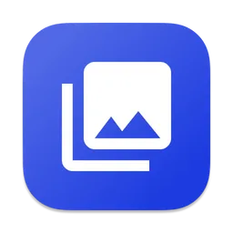
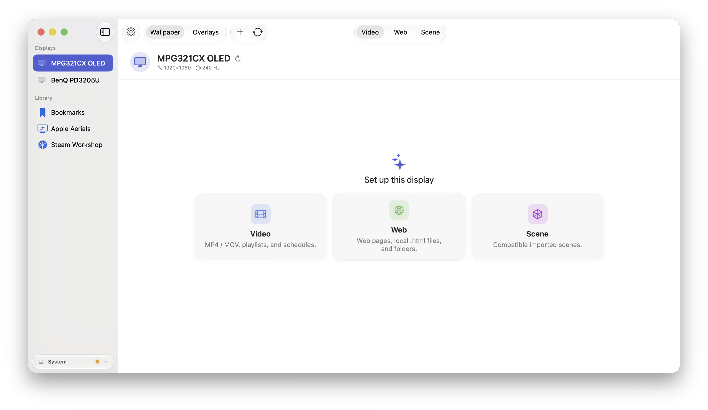
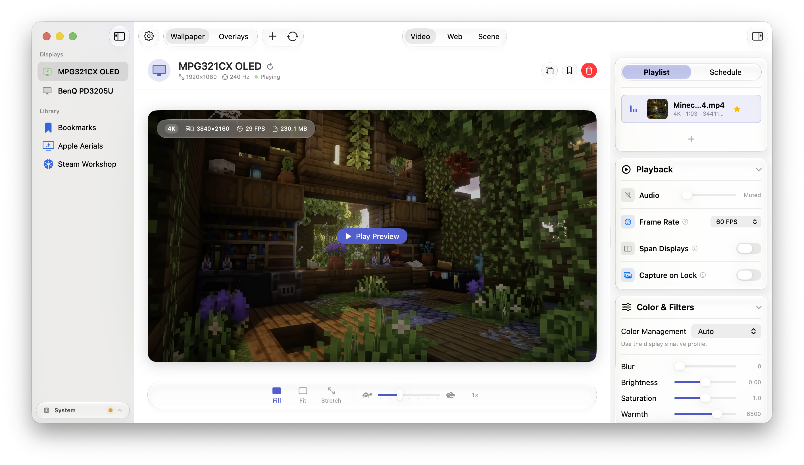
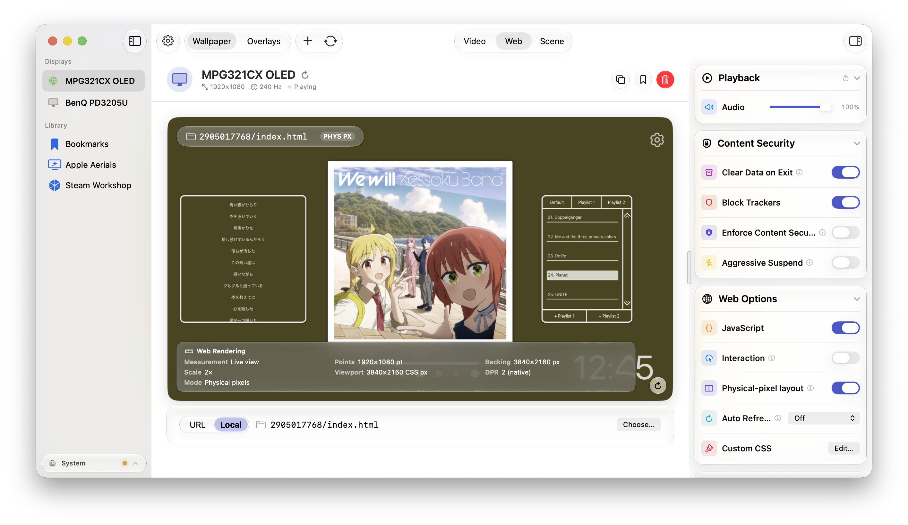
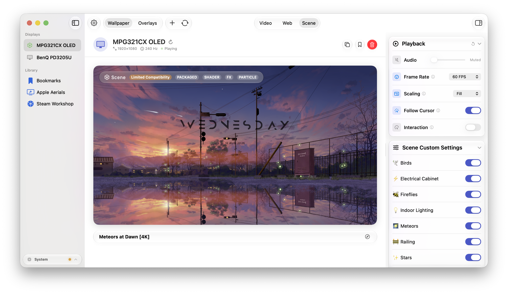
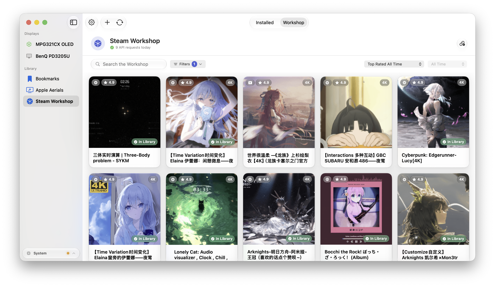

# Loomscreen

<div align="center">



### 在 macOS 上运行 Wallpaper Engine 场景 —— 原生 Metal 渲染器，另支持视频与网页壁纸，多显示器统一管理。


[⬇ 下载](https://github.com/Paradox07127/macos-wallpaperengine/releases/latest) ·
[🚀 快速上手](docs/quick-start.md) ·
[✨ 功能](docs/features.md) ·
[⚖ Lite vs Pro](docs/lite-vs-pro.md) ·
[🛠 构建](docs/building.md) ·
[🇬🇧 English](README.md)

</div>

> 独立的 Metal 实现，与 Wallpaper Engine 无关联；Workshop 内容通过你自己的 Steam 账号与授权下载。



## 壁纸类型

| 类型 | 版本 | 能力 |
|---|---|---|
| **Wallpaper Engine 场景** | Pro | 原生 Metal 渲染 `scene.pkg` 项目 —— 粒子、着色器特效、木偶变形动画、音频反应图层、光标特效。支持导入本地项目文件夹或通过 Steam Workshop 下载。 |
| **视频** | Lite + Pro | `mp4` / `m4v` / `mov` / `avi`，平滑循环，HDR 感知色彩管线，可逐屏播放或跨所有屏幕铺展。 |
| **网页** | Lite + Pro | 沙盒化 `WKWebView`，支持 JavaScript 开关、跟踪器拦截、自定义 CSS、定时自动刷新。 |
| **Apple Aerials** | Lite + Pro | 浏览并应用 Mac 上已有的 Apple TV 航拍视频。 |

## 实际效果

| | |
|:---:|:---:|
|  **视频** |  **网页** |
|  **场景（Pro）** |  **Workshop（Pro）** |

## 不只是播放器

- **每屏独立控制** —— 每台显示器运行各自的壁纸；可一键复制到所有屏幕，或让一个视频跨屏铺展。
- **播放列表与排程** —— 随机播放、轮换间隔、按时段自动切换，书签库一键换壁纸。
- **菜单栏优先** —— 全局开关、每屏播放/暂停与上下切换，实时 CPU / GPU / 内存 / 热压力状态条。
- **任何壁纸都能叠加 Overlay** —— 九种粒子特效（雪、雨、樱花、萤火虫……）、跟随真实天气的反应模式、系统监控面板（CPU/GPU/网络等组件，含 AI agent 会话追踪）。
- **笔记本友好** —— 全屏应用、窗口遮挡、电池供电、低电量模式下自动暂停，并支持按 App 自定义规则。
- **全局快捷键** —— 七个可绑定动作，从全部播放/暂停到重载。
- **配置可迁移** —— 整套设置导出/导入为 `.lwconfig` 文件。
- **默认隐私** —— 无账号、无数据上报。

## 版本划分

| | **Lite**（免费，MIT） | **Pro** |
|---|:---:|:---:|
| 视频 / 网页 / Apple Aerials、播放列表、排程、Overlay、快捷键 | ✅ | ✅ |
| Wallpaper Engine 场景渲染与导入 | — | ✅ |
| Steam Workshop 在线浏览与下载 | — | ✅ |
| 音频反应场景（系统音频捕获） | — | ✅ |
| 自适应帧率与逐屏独立渲染线程 | — | ✅ |
| 应用内更新检查 | ✅ | — |

Lite 是更轻的运行时，不是阉割版 UI —— 视频、网页、Aerials 的保真度与 Pro 完全一致。完整对照：[docs/lite-vs-pro.md](docs/lite-vs-pro.md)。

## 安装

1. 从 [Releases](https://github.com/Paradox07127/macos-wallpaperengine/releases/latest) 下载最新 `Loomscreen-x.y.z.dmg`。
2. 拖拽 **Loomscreen.app** 到 `/Applications`。
3. 清除一次 Gatekeeper 隔离标记（构建为 ad-hoc 签名）：
   ```bash
   xattr -dr com.apple.quarantine /Applications/Loomscreen.app
   ```
4. 启动 —— Loomscreen 常驻菜单栏，首次启动的引导会帮你设好第一张壁纸。

安装细节、权限弹窗与更新方式：[docs/install.md](docs/install.md) · 首次配置全流程：[docs/quick-start.md](docs/quick-start.md)

## 运行要求

- macOS 14.6 及以上
- Apple Silicon（不支持 Intel）

## 从源码构建

```bash
git clone https://github.com/Paradox07127/macos-wallpaperengine.git
cd macos-wallpaperengine
open LiveWallpaper.xcodeproj
```

Scheme：`LiveWallpaperLite`（Lite）· `LiveWallpaper`（Pro）。环境要求与测试门禁：[docs/building.md](docs/building.md)。

## 贡献与许可

欢迎 Issue 和 PR —— 提 PR 前先跑 [docs/building.md](docs/building.md) 里的检查；安全问题请走 GitHub Security Advisories。报 Bug 建议直接用应用内 **Settings → About → Report a Bug…**，它会自动附带诊断信息。

MIT（[LICENSE](LICENSE)）—— 覆盖整个仓库，含 Pro-only 模块。
