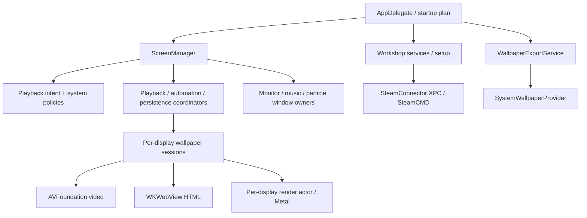
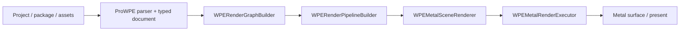

# Architecture

**English** · [简体中文](../zh-Hans/architecture.md)

Loomscreen is a local macOS application. SwiftUI provides the settings and
library UI, AppKit owns desktop windows, and AVFoundation, WKWebView and Metal
provide the three wallpaper runtime paths. There is no application server.
Optional network clients serve Workshop, weather, artwork/lyrics and updates.

## Targets and packages

| Component | Responsibility |
|---|---|
| `LiveWallpaper` / `LiveWallpaperLite` | Pro and Lite app targets; startup, UI, sessions, policies, persistence adapters and platform services |
| `Packages/LiveWallpaperCore` | Shared schemas, capability catalog, playback state machine, persistence utilities and SwiftUI design system |
| `Packages/LiveWallpaperProWPE` | WPE package/scene/model parsing and typed schema; depends on Core |
| `SteamConnector` | Pro's XPC service; SteamCMD discovery, verification, sign-in and library operations outside the host app sandbox |
| `SystemWallpaperProvider` | macOS wallpaper extension; serves published videos separately from the running app |

Core contains shared UI as well as data/runtime contracts; it is not a UI-free
domain package. The WPE Metal renderer is in the app target's `Runtime/Metal`,
not in ProWPE. There is no separate SharedUI or VideoWeb package.

Lite compiles app sources with `LITE_BUILD` and does not link the ProWPE
product. Xcode app conditions do not propagate into Swift packages.
`ProductCapabilities` and `FeatureCatalog` expose the runtime capability set;
the app adds Workshop capability for Pro at startup. Missing catalog injection
is featureless, rather than defaulting to Pro.

## App and session ownership

- `LiveWallpaper/App/LiveWallpaperApp.swift` constructs app-lifetime services,
  manages settings/onboarding windows, and coordinates startup and termination.
- `LiveWallpaper/App/ScreenManager.swift` and its extensions manage display
  identity, configuration, policy and runtime reconciliation. The class delegates
  playback transitions, automation and persistence to dedicated coordinators.
- `LiveWallpaper/Runtime/Session/` owns preparation, activation, pause,
  hibernation and teardown for video, HTML and scene sessions.
- User intent lives in a per-screen `WallpaperPlaybackStateMachine`. Policy
  can suspend rendering without rewriting the user's play/pause choice.
  Transition/configuration generations reject obsolete asynchronous results.
- Monitor, music and particles have separate window owners and per-display
  settings. Sharing a display does not make them part of the wallpaper decoder.

## WPE render pipeline

The app resolves primary, dependency and engine-asset roots under their file
access grants. Graph/pipeline construction validates and prepares the scene;
shader preprocessing, translation and compilation have cache identities.
The frame path combines script state, audio, pointer input, dynamic textures,
text and particles before executing the prepared passes.

`Runtime/Metal/RenderThread/WPEDisplayRenderActor.swift` owns its renderer in a
serial isolation domain. It supports a dedicated render-thread executor and a
main-executor backing. Configuration commands pass through a FIFO stream;
frame readiness and generations guard load/reload/teardown boundaries.
`WPEFrameInputs`, prepared passes, frame state, uniform plans and texture/target
caches are existing contracts, not interchangeable rendering backends.

Compatibility tests and local Metal traces validate specific paths. They do
not establish full Windows parity. Shader, blend, particle and attachment
semantics need reference/Windows evidence when changed; do not infer WPE
behavior solely from this renderer's comments. Pixel equality is not the
acceptance criterion for random effects or font rendering.

## Persistence and background work

Configuration uses JSON, UserDefaults and security-scoped bookmarks. Core owns
data models and serialization utilities; app adapters connect them to settings,
bookmarks, schemes and runtime changes. `.lwconfig` stores settings and
references, not a portable copy of wallpaper media or secrets.

Storage inventory resolves roots and holds scopes on MainActor, then scans via
`WPEStorageInventoryScanner`. The scan checks cancellation and per-root work
budgets; the settings UI accepts only the newest generation. This boundary is
already implemented, rather than a planned migration off the UI actor.

Monitor data sources publish snapshots into shared history. Views distinguish
missing measurements from zero; network/disk accumulated values are estimates.
Now Playing metadata, artwork and playhead work follow source demand and track
identity. Preview data uses existing snapshots/caches instead of creating a
second wallpaper session.

## External execution and secrets

The app remains sandboxed. Pro uses the existing unsandboxed SteamConnector
XPC service for SteamCMD; a helper receipt is not a file-access grant. Before
import, the app locates the requested item in the authorized Steam library and
revalidates that folder. App-managed repository mutations coordinate downloads
and deletion, but do not lock out an independently running Steam client.

New Steam API keys go to the login Keychain. Legacy file migration is retained
for older installations. In-app sign-in passes credentials through XPC to the
SteamCMD terminal input; Loomscreen does not save the password/Guard code or
place it in command arguments or logs. SteamCMD manages cached login state.

HTML has separate local-file and remote/network policy boundaries. Diagnostics
are local and redacted; online requests still exist for enabled features.
Details: [Security](../SECURITY.md).

## System Wallpaper provider

On macOS 26+, `WallpaperExportService` copies supported video files and publishes
a manifest for `SystemWallpaperProvider`. The extension renders independently
of the app, publishes a heartbeat, and performs compatibility checks. macOS
chooses the active wallpaper; the app's library status is not an authoritative
view of every system-side state.

The provider uses private wallpaper/XPC integration bridges contained in
`SystemWallpaperProvider/`. Treat it as a version-sensitive platform boundary,
not a public general-purpose wallpaper SDK. It does not host the WPE/HTML
runtime or the app's overlay windows. An incompatible provider can disable its
own path without replacing the normal app wallpaper architecture.

## Design and verification

Shared components and tokens live under Core's `UI/`; the contract is
[DESIGN.md](../../Packages/LiveWallpaperCore/DESIGN.md). User-facing changes
preserve five-language coverage and accessibility behavior.

`make verify` orders structure/localization, tooling contracts, changed-line
lint, package tests and the app contract shard. The complete signed Pro suite
and Lite/archive release checks are separate, broader gates. A passing shard
is not a full application run. See [Building](building.md) and
[Releasing](releasing.md) for exact commands.
