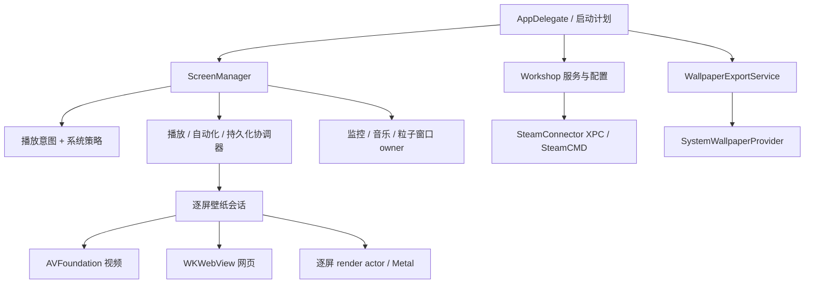
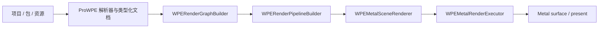

# 架构说明

[English](../en/architecture.md) · **简体中文**

Loomscreen 是本地 macOS 应用：SwiftUI 提供设置与资源库界面，AppKit 管理桌面窗口，
AVFoundation、WKWebView、Metal 分别承载三类壁纸运行路径。没有应用服务端；
可选网络客户端用于创意工坊、天气、封面/歌词和更新。

## Target 与包

| 组件 | 职责 |
|---|---|
| `LiveWallpaper` / `LiveWallpaperLite` | Pro 与 Lite 应用 target；启动、UI、会话、策略、持久化适配和平台服务 |
| `Packages/LiveWallpaperCore` | 共享 schema、能力目录、播放状态机、持久化工具和 SwiftUI 设计系统 |
| `Packages/LiveWallpaperProWPE` | WPE 包、场景、模型解析与类型化 schema；依赖 Core |
| `SteamConnector` | Pro 的 XPC 服务；在宿主沙盒外负责 SteamCMD 查找、验证、登录和库操作 |
| `SystemWallpaperProvider` | macOS 壁纸扩展；独立于应用播放已发布的视频 |

Core 同时包含共享 UI 和数据/运行时契约，不是纯领域模型包。WPE Metal 渲染器位于
应用 target 的 `Runtime/Metal`，不在 ProWPE 包中。当前没有独立的 SharedUI 或 VideoWeb 包。

Lite 应用源码以 `LITE_BUILD` 编译，且不链接 ProWPE product。Xcode 应用编译条件不会
传入 Swift 包。`ProductCapabilities` 与 `FeatureCatalog` 提供运行时能力集合，
应用在启动时为 Pro 加入 Workshop 能力；未注入目录时不授予功能，不默认当作 Pro。

## 应用与会话所有权

- `LiveWallpaper/App/LiveWallpaperApp.swift` 装配应用级服务，管理设置/引导窗口，协调启动和退出。
- `LiveWallpaper/App/ScreenManager.swift` 及扩展管理显示器身份、配置、策略与运行时协调；播放切换、自动化和持久化交给专用 coordinator。
- `LiveWallpaper/Runtime/Session/` 管理视频、HTML、场景的准备、激活、暂停、休眠和销毁。
- 用户意图由每屏 `WallpaperPlaybackStateMachine` 保存。策略暂停不改写播放/暂停选择；切换与配置 generation 拒绝过时的异步结果。
- 监控、音乐与粒子各有窗口 owner 和逐屏设置，共用显示器不意味着共用壁纸解码器。

## WPE 渲染管线

应用在文件授权范围内解析主项目、依赖和引擎资源根。graph/pipeline 构建验证并准备场景；
shader 预处理、转译和编译具有缓存身份。逐帧路径综合脚本状态、音频、指针、动态纹理、
文字与粒子，再执行已准备的 pass。

`Runtime/Metal/RenderThread/WPEDisplayRenderActor.swift` 在串行隔离域内持有 renderer，
支持独立渲染线程 executor 或主 executor。配置命令通过 FIFO stream 传递，
frame readiness 与 generation 保护加载、重载和销毁边界。
`WPEFrameInputs`、prepared pass、frame state、uniform plan、纹理/target cache 都是
已有契约，不是可互换的渲染后端。

兼容性测试与本地 Metal trace 验证具体路径，不证明完整 Windows parity。
修改 shader、混合、粒子和 attachment 语义需要参考实现/Windows 证据，不能只从当前
渲染器的注释反推 WPE 行为。随机效果与字体呈现不以像素完全相同为验收标准。

## 持久化与后台工作

配置使用 JSON、UserDefaults 与 security-scoped bookmark。Core 提供模型和序列化工具，
应用适配层连接设置、书签、方案和运行时变更。`.lwconfig` 保存设置与引用，
不打包可移植的壁纸媒体或密钥。

存储 inventory 在 MainActor 解析根目录并持有 scope，然后由 `WPEStorageInventoryScanner`
扫描。扫描检查取消和每根工作预算；设置 UI 只接收最新 generation。
这条离开 UI actor 的扫描边界已经实现。

Monitor 数据源发布快照并使用共享历史。视图区分缺测和零值，网络/磁盘累计仍为估算。
Now Playing 元数据、封面与播放位置工作跟随数据源需求和曲目身份。
预览使用已有快照/缓存，不创建第二份壁纸会话。

## 外部执行与密钥

主应用保持沙盒。Pro 已通过非沙盒 SteamConnector XPC 执行 SteamCMD；helper 的回执
不等于文件授权。导入前应用按请求项目 ID 在授权 Steam 库中定位，再复验目录。
应用内仓库修改协调下载与删除，但无法锁住独立运行的 Steam 客户端。

新 Steam API key 保存到登录钥匙串，旧安装仍保留文件迁移路径。应用内登录经 XPC
把凭据交给 SteamCMD 终端输入；Loomscreen 不保存密码/Guard code，不把它们放入命令参数
或日志。缓存登录状态由 SteamCMD 管理。

HTML 的本地文件与远程/网络策略各有边界。诊断在本地生成并脱敏，启用在线功能仍会产生
网络请求。详见[安全策略](SECURITY.md)。

## 系统壁纸 provider

macOS 26+ 上，`WallpaperExportService` 复制支持的视频文件并发布 manifest，供
`SystemWallpaperProvider` 读取。扩展独立于应用渲染、发布 heartbeat，并检查兼容性。
活动壁纸由 macOS 选择，应用资源库状态不能代表所有系统侧状态。

provider 使用的私有壁纸/XPC 桥接被限制在 `SystemWallpaperProvider/` 中，是随系统版本
变化的平台边界，不是公开的通用壁纸 SDK。它不运行 WPE/HTML runtime 或应用叠加窗口。
provider 不兼容时可以关闭自身路径，不替换应用原有壁纸架构。

## 设计与验证

共享组件与 token 位于 Core 的 `UI/`，契约见
[DESIGN.md](../../Packages/LiveWallpaperCore/DESIGN.md)。用户可见改动保持五语与无障碍行为。

`make verify` 按顺序执行结构/本地化、工具契约、改动行 lint、包测试和应用契约分片。
完整签名 Pro 套件、Lite/archive 发版检查是范围更广的独立门禁；分片通过不等于全量应用测试。
具体命令见[构建](building.md)与[发版](releasing.md)。
